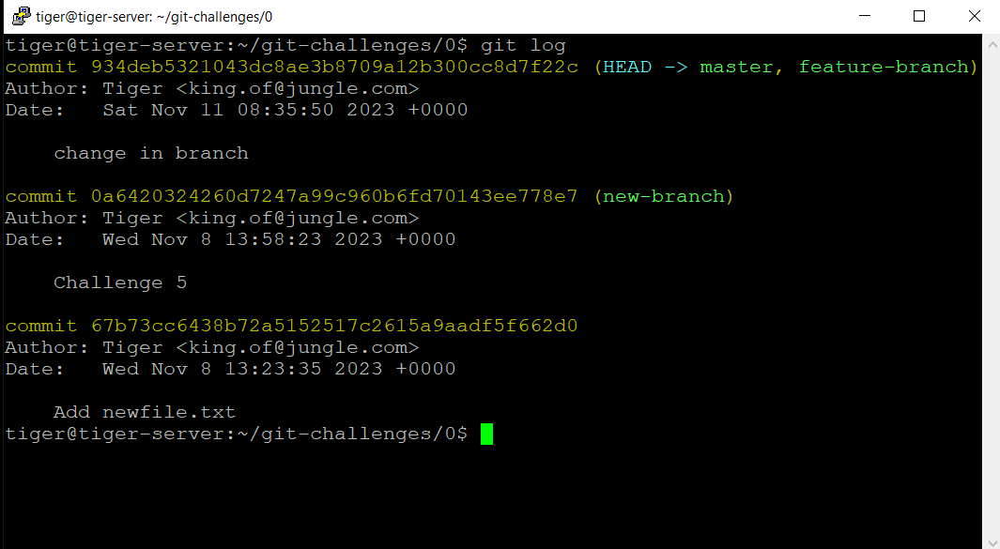
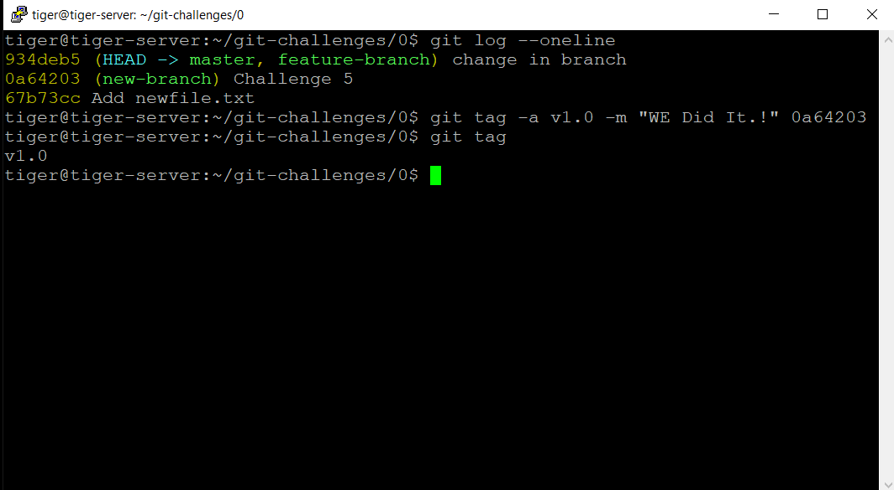
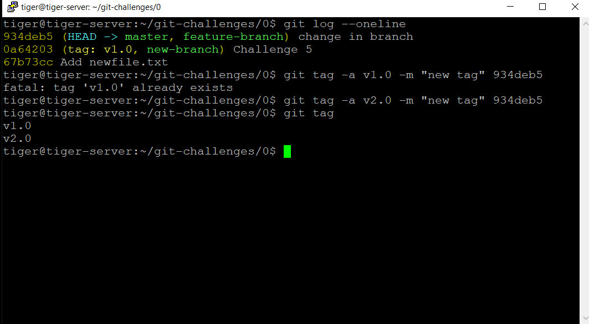
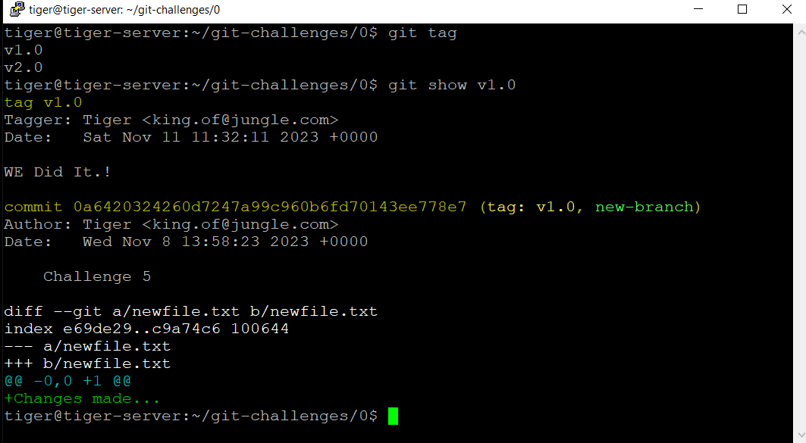

# Challenge 0.10: Tagging Commits - Solution

In this solution, we'll walk through the process of creating and managing Git tags, which are used to mark specific commits as significant milestones in a project's history.

## Solution Steps

### 1. Open your local reposiroty.

### 2. **View the Commit History**:

- Use the `git log` to view the commit history.
- Identify a specific commit that you want to tag as a significant milestone.

  ```bash
  git log
  ```

  

- we select this commit ->
  ```bash
  commit 0a6420324260d7247a99c960b6fd70143ee778e7
  ```

### 3. **Create an Annotated Tag**

- Create an annotated tag for the chosen commit using the `git tag` command.
- Provide a descriptive tag name (e.g., "v1.0") and an informative tag message that describes the significance of the tagged commit:

  ```bash
  git tag -a <tag_name> -m "Tag message" <commit_hash_or_reference>
  ```

- `-a`: Creates an annotated tag.
- `<tag_name>`: The name you want to give to your tag.
- `-m` "Tag message": An optional message describing the tag.
- `<commit_hash_or_reference>`: The commit hash or reference you want to tag.
- Verify that the tag has been created by using the `git tag` command.

  ```bash
  git log --oneline
  git tag -a v1.0 -m "WE Did It.!" 0a64203
  ```

  

### 4. Lets create another tag.

```bash
git log --oneline
git tag -a v2.0 -m "new tag" 934deb5
```



### 5. View the details of a specific tag

- use the `git show` command.
  `bash
  git show <tag_name>
  `
  

### 6. Use of Tags in Git

1. **Stable Reference Points:**

   - Provide stable reference points to specific commits.

2. **Versioning Releases:**

   - Mark version releases for reproducibility and version management.

3. **Documentation:**

   - Serve as documentation for significant project milestones.

4. **Collaboration and Communication:**

   - Enhance collaboration by clearly communicating achievements.

5. **Release Notes:**

   - Facilitate release notes, summarizing changes for each version.

6. **Rollbacks and Hotfixes:**

   - Allow for easy rollback to stable states and hotfix integration.

7. **Integration with CI/CD:**

   - Play a role in CI/CD pipelines, triggering actions based on releases.

8. **Historical Insights:**

   - Provide insights into project evolution and major milestones.

9. **Open Source Collaboration:**

   - Valuable for external collaborators in understanding project history.

10. **Branch Divergence:**
    - Manage branch divergence by marking commits corresponding to versions.

← [Back to Challenge](../Challenge_0.10/Challenge.md) || [Index](../../README.md) || [Next Challenge →](../Challenge_0.11/Challenge.md)
