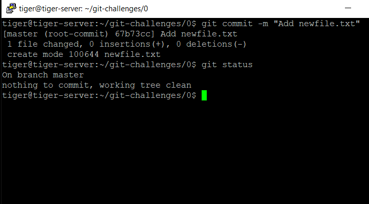

# Challenge 0.4: Checking Repository Status - Solution

In this solution, we'll walk through the process of using the `git status` command to check the status of a Git repository and understand the information it provides.

## Solution Steps

2. **Check the Repository Status**: Open your terminal and navigate to a directory where you have a Git repository. To check the status of the repository, use the `git status` command:

   ```bash
   git status
   ```

   

3. **Check the Repository Status Again:** After creating the new file (newfile.txt), use the git status command once more to check the repository status:

   ```bash
   git status
   ```

   

4. **Stage the New File**: To stage the new file, use the `git add` command:

   ```bash
   git add newfile.txt
   ```

   ```bash
   git status
   ```

   

5. **Commit the Changes**: Commit the staged changes with an informative commit message using the `git commit` command:

   ```bash
   git commit -m "Add newfile.txt"
   ```

6. **Check the Repository Status Once More**: Use the `git status` command.

   ```bash
   git status
   ```

   

7. **Flags and options**: `git status --help`

← [Back to Challenge](../Challenge_0.4/Challenge.md) || [Index](../../README.md) || [Next Challenge →](../Challenge_0.5/Challenge.md)
