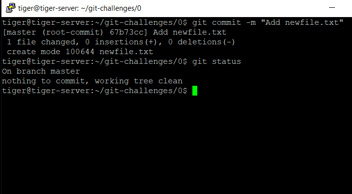
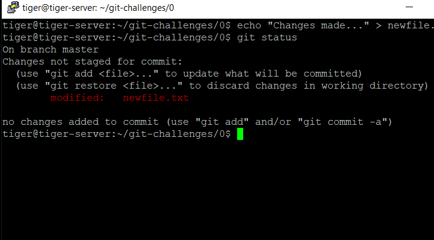
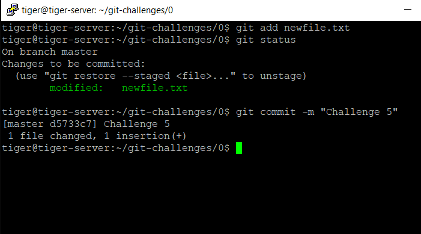
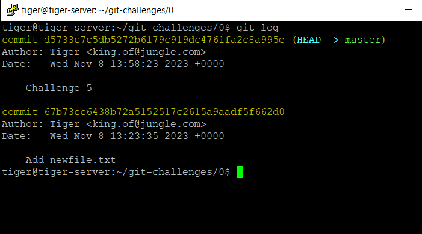

# Challenge 0.5: Staging and Committing Changes - Solution

In this solution, we'll walk through the process of staging changes using the `git add` command and committing those changes with informative commit messages using the `git commit` command.

## Solution Steps

1.  **Check Repository Status**: Open your terminal and navigate to a directory with a Git repository. Use the `git status` command to check the status of the repository and identify the changes you've made:

    ```bash
    git status
    ```

    

2.  **Create or modify**:

    ```bash
     echo "Changes made..." > newfile.txt
    ```

3.  **Check the status after changes**

    ```bash
    git status
    ```

    

4.  **Stage your changes** using the `git add` command.

    ```bash
    git add newfile.txt
    ```

5.  **Check the status after stagging**:
    ```bash
    git status
    ```
6.  **Commit**:

    ```bash
    git commit -m "challenge 5"
    ```

    

7.  **View the commit history**:

    ```bash
    git log
    ```

    

8.  **Repeat the process**:

9.  **Commit options and flags**: `git commit --help` for more details.

    - Basic Commit: Creates a new commit with the specified message.

      ```bash
      git commit -m "Your commit message"
      ```

    - Amend Last Commit: Allows you to amend the last commit with new changes or a new message.

      ```bash
      git commit --amend
      ```

    - Include Staged Changes Only: Commits all changes, including those that are already staged.

      ```bash
      git commit -m "Your message" -a
      ```

    - Interactive Staging: Starts an interactive staging session, allowing you to choose which changes to
      include in the commit.

      ```bash
      git commit -i
      ```

    - Signing Commits: Signs the commit with GPG.

      ```bash
      git commit -S
      ```

    - Change Committer Information: Allows you to specify the author of the commit.

      ```bash
      git commit --author="Author Name <email@example.com>"
      ```

    - Commit Only Certain Files: Commits only the specified files.

      ```bash
      git commit file1.txt file2.txt -m "Your message"
      ```

    - Change Commit Date: Lets you set a custom commit date.

      ```bash
      git commit --date="YYYY-MM-DD HH:MM:SS"
      ```

    - Commit with Specific Timezone: Sets the commit date to the local timezone.

           ```bash
           git commit --date="YYYY-MM-DD HH:MM:SS" --date=local
           ```

← [Back to Challenge](../Challenge_0.5/Challenge.md) || [Index](../../README.md) || [Next Challenge →](../Challenge_0.6/Challenge.md)
