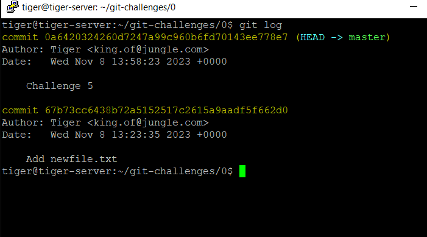
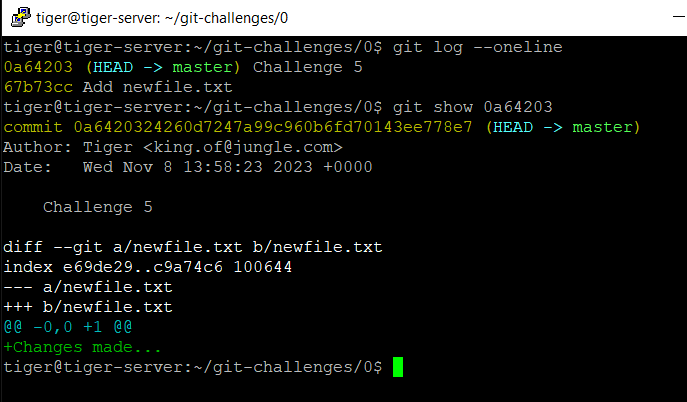

# Challenge 0.6: Viewing Commit History - Solution

In this solution, we'll walk through the process of using the `git log` command to view the commit history of a Git repository.

## Solution Steps

1. Navigate to a directory with a Git repository.

2. **View the Commit History**: Open your terminal and navigate to a directory with a Git repository. To view the commit history, use the `git log` command:

   ```bash
   git log
   ```

   

3. **Use the `git log` command to**:

   - Display Commit History for a Specific Branch:
     ```bash
     git log branch_name
     ```
   - Display Commit History for a Specific Tag:
     ```bash
     git log tag_name
     ```
   - Display Commit History for a Specific Commit Hash:
     ```bash
     git log commit_hash
     ```
   - Compare commit history between two branches:
     ```bash
     git log branch1..branch2
     ```
   - Compare commit history between two tags:
     ```bash
     git log tag1..tag2
     ```
   - Compare commit history between two commit hashes:
     ```bash
     git log commit_hash1..commit_hash2
     ```

4. **To identify a specific commit**: `git show <commit_hash>`

   ```bash
   git log --oneline
   ```

   ```bash
   git show <commit_hash>
   ```

   

5. **Options and flags available with the `git log` command**:

- Show the last 5 commits

  ```bash
  git log -n 5
  ```

- Show abbreviated commit hash, author, date, and commit message

  ```bash
  git log --oneline
  ```

- Show commits in a specific format

  ```bash
  git log --pretty=format:"%h - %an, %ar : %s"
  ```

- Show commit history for a specific file

  ```bash
  git log filename
  ```

- Show commit history with details for a specific branch

  ```bash
  git log branch_name
  ```

- Show commits since a specific date

  ```bash
  git log --since="2023-01-01"
  ```

- Show commits that introduced or removed a specific keyword
  ```bash
  git log -S"keyword"
  ```

#### Extra `git tag`

- A Git tag is a reference to a specific commit in your Git history. Tags are often used to mark specific points in your project's history, such as releases or significant milestones.
  - To set a tag, you can use the `git tag` command.
    ```bash
    git tag tag_name
    ```
    ```bash
    # Create an annotated tag with a message
    git tag -a tag_name -m "Tagging version 1.0"
    ```
  - List your tag:
    ```bash
    git tag
    ```
  - view the commit history associated with a specific tag.
    ```bash
    git log tag_name
    ```
  - If you're unsure whether tags exist in your repository or want to see their details, you can use:
    ```bash
    git show tag_name
    ```

← [Back to Challenge](../Challenge_0.6/Challenge.md) || [Index](../../README.md) || [Next Challenge →](../Challenge_0.7/Challenge.md)
