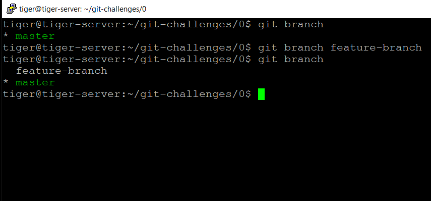
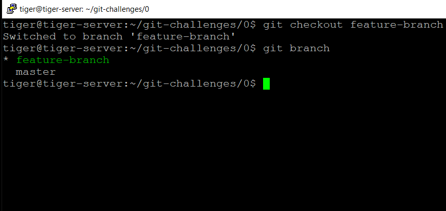
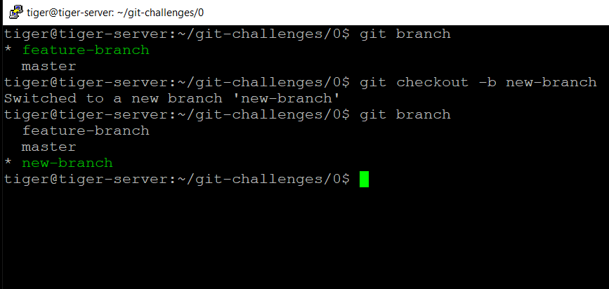
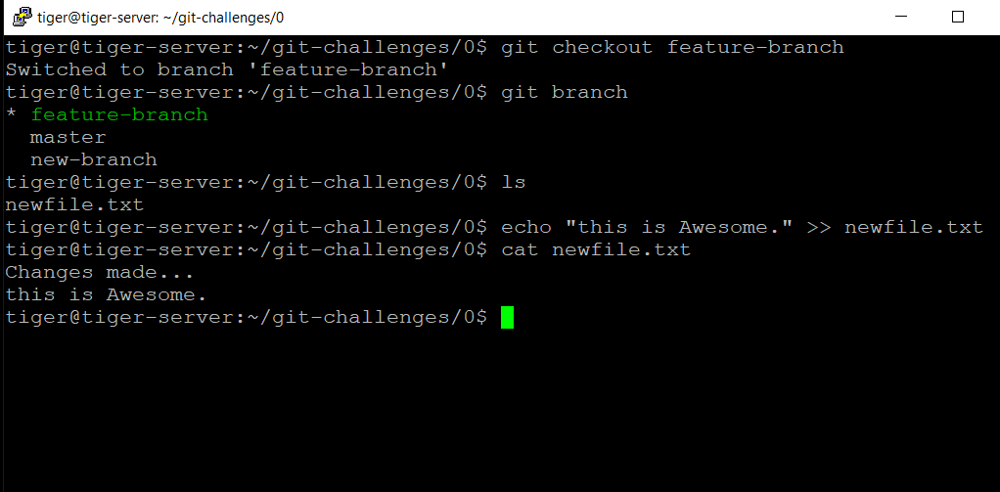
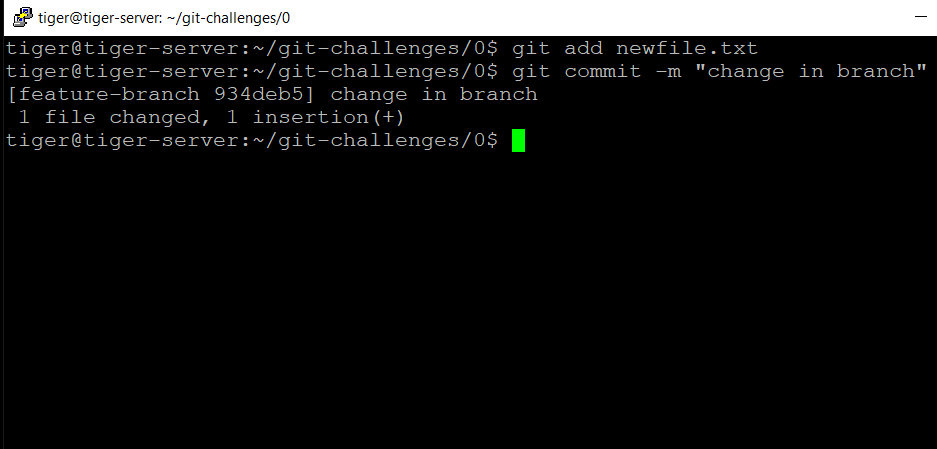
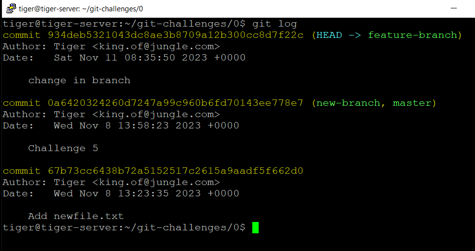

# Challenge 0.7: Creating and Switching Branches - Solution

In this solution, we'll walk through the process of creating new branches using the `git branch` and `git checkout` commands and working with multiple branches in a Git repository.

## Solution Steps

1. Open your terminal and navigate to a directory with a Git repository.

2. **List Existing Branches**: Use the `git branch` command to list the existing branches in the repository, and observe the current branch (usually indicated with an asterisk):

   ```bash
   git branch
   ```

3. Create a new branch with a descriptive name using the `git branch` command.

   ```bash
   git branch feature-branch
   ```

   

   With this you have created a new branch, but you are on the **master** branch, seen by the asterisk.

4. Use the `git branch` command.
5. **Switch to the newly created branch** using the git checkout command. For example:

   ```bash
   git checkout feature-branch
   ```

   

##### Alternate way:

- Creating and switching to the newly creaded branch, in a single command.
- Use option `-b`.
  ```bash
  git checkout -b new-branch
  ```
  

6. **Create or modify a text file**

   - Switch to **"feature-branch"**.
   - Modify the files.
     

7. **Commit the changes**
   ```bash
   git add newfile.txt
   git commit -m "change in branch"
   ```
   
8. **View the commit history**

   ```bash
   git log
   ```

   

9. **Importance of Branching in Git**

   Branching in Git is crucial for:

   1. **Parallel Development:**

      - Enables simultaneous work on different features.

   2. **Feature Isolation:**

      - Provides dedicated spaces for changes, preventing interference.

   3. **Risk Mitigation:**

      - Allows experimentation without impacting the main codebase.

   4. **Collaboration:**

      - Facilitates independent work and smooth collaboration.

   5. **Code Review:**

      - Makes reviews manageable by focusing on specific branches.

   6. **Release Management:**

      - Supports stable releases and ongoing development.

   7. **Emergency Fixes:**

      - Enables the creation of hotfix branches for urgent changes.

   8. **Experimentation:**

      - Facilitates prototyping and trying out new ideas.

   9. **Versioning:**

      - Represents different stages of development for versioning.

   10. **Conflict Resolution:**

   - Provides tools for resolving conflicts during branch merges.

   In summary, branching streamlines development, fosters collaboration, and enhances code stability.

← [Back to Challenge](../Challenge_0.7/Challenge.md) || [Index](../../README.md) || [Next Challenge →](../Challenge_0.8/Challenge.md)
