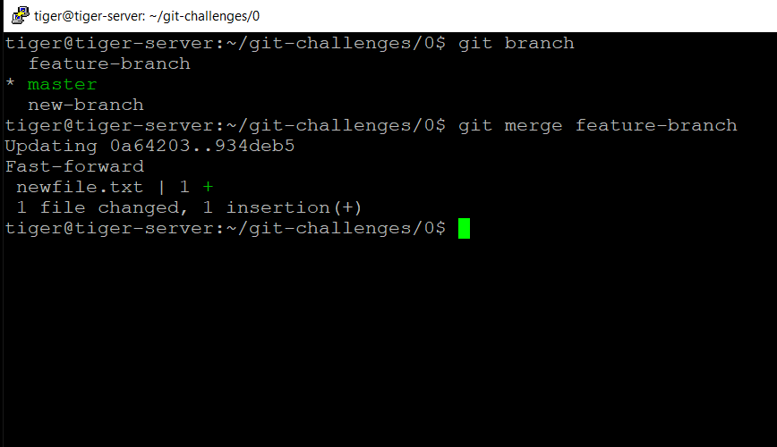

# Challenge 0.8: Merging and Resolving Conflicts - Solution

In this solution, we'll walk through the process of merging changes from one branch into another using the `git merge` command. Additionally, we'll address the scenario where conflicts arise during the merging process and how to resolve them.

## Solution Steps

### 1. **Use the previously created branch.**

### 2. **Switch to another branch & `merge`**

- We want to merge the changes in "master" branch from "feature-branch".
- Make sure you are in "master" branch. `git branch`.

```bash
git merge feature-branch
```



- This command will integrate the changes from feature-branch into the currently checked-out branch (i.e., master).
- Git will automatically handle the merge process and create a new commit to represent the merge.

### 3. **Merge conflicts.**

If the branches have diverged, meaning changes have been made in both branches since they diverged, Git might prompt for a merge commit message or require manual resolution of conflicts.

### 4. **Steps to resolve conflicts**

- If conflicts occur during the merge, resolve them manually by editing the conflicting files.
- Use the `git status` command to identify the conflicted files and open them with a text editor.

- After resolving conflicts, use the `git add` command to stage the resolved files.

- Complete the merge using `git commit`.
- Use the `git log` command to view the commit history and verify that your merge commit is in place.

- Reflect on the merging process and the importance of conflict resolution in collaborative Git workflows.

### 5. Experiment

#### Experimenting with Merge Strategies:

1.  **Regular Merge:**
    - The default merge strategy is the recursive strategy. It's suitable for most scenarios.
      ```bash
      # Perform a regular merge
      git merge feature-branch
      ```
2.  **Octopus Merge:**

    - Used for merging multiple branches into one. This is helpful when merging more than two branches.
      ```bash
      # Merge multiple branches into one
      git merge branch1 branch2 branch3
      ```

3.  **Resolve Merge Strategy:**

    - Manually resolve conflicts during the merge.

      ```bash
      # Start a merge with conflict
      git merge feature-branch

      # Resolve conflicts manually

      # Complete the merge
      git merge --continue
      ```

4.  **Ours Merge Strategy:**
    Resolve conflicts by favoring the changes from the current branch.

    ```bash # Start a merge with conflict
    git merge -s ours feature-branch

    # Complete the merge
    git merge --continue
    ```

5.  **Subtree Merge Strategy:**
    Allows you to merge a subdirectory from another repository.
    ```bash
     # Merge a subdirectory from another repository
     git merge -X subtree=subdirectory another-repo/main
    ```

#### Exploring Git's Merge Conflict Tools:

1. **Conflicts in a File:**

   - Create conflicts intentionally to see how Git marks them in a file.

   ```bash
   # Start a merge with conflict
   git merge feature-branch

   # Resolve conflicts manually in the conflicted file

   # Complete the merge
   git merge --continue
   ```

2. **Conflict Markers:**
   Observe conflict markers in the file (<<<<<<<, =======, >>>>>>>).

   ```bash
   <<<<<<< HEAD
   Changes from main branch
   =======
   Changes from feature branch
   >>>>>>> feature-branch
   ```

3. **Visual Merge Tool:**
   Use a visual merge tool to resolve conflicts.

   ```bash
   # Configure a visual merge tool
   git config --global merge.tool <tool-name>

   # Start a merge with conflict
   git merge feature-branch

   # Resolve conflicts using the configured visual merge tool

   # Complete the merge
   git merge --continue
   ```

4. **Aborting Merge:**
   If conflicts become too complex, you can abort the merge.

   ```bash
   # Abort the current merge
   git merge --abort
   ```

← [Back to Challenge](../Challenge_0.8/Challenge.md) || [Index](../../README.md) || [Next Challenge →](../Challenge_0.9/Challenge.md)
